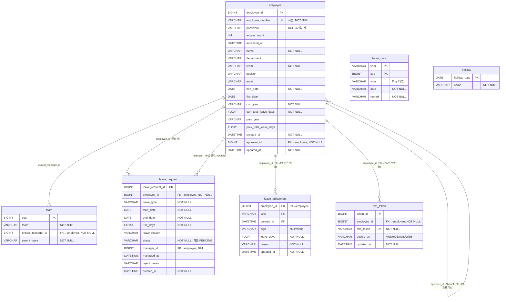

# annual-leave-backend

`annual-leave-backend`는 사내 연차(휴가) 관리 앱의 백엔드 API 서버입니다.
직원의 연차 신청, 조회, 관리자의 승인, 반려 그리고 대시보드 집계, 공휴일 동기화, 푸시 알림을 담당합니다.

## 시스템 아키텍처

## 사용 기술

| 구분 | 기술 | 비고                                                          |
|---|---|-------------------------------------------------------------|
| 언어/런타임 | Java 21 | `sourceCompatibility=21`, `-parameters` 컴파일 (툴체인 블록 비활성)    |
| 프레임워크 | Spring Boot 4.1.0 | Spring Web MVC 기반                                           |
| 빌드 도구 | Gradle (Groovy DSL) | `gradlew` 래퍼, `bootJar` → `annual-leave-backend.jar`        |
| 데이터베이스 | MySQL | `com.mysql:mysql-connector-j`, utf8mb4 / utf8mb4_unicode_ci |
| 영속성 | Spring Data JPA (Hibernate) | `ddl-auto` 미설정 (스키마 자동 생성 안 함)                              |
| SQL 로깅 | p6spy | `p6spy-spring-boot-starter:2.0.1`, `spy.properties`         |
| 보안 | Spring Security + JWT | `jjwt 0.12.6`, 무상태 세션                                       |
| 캐시 | Caffeine | 로컬 인메모리 캐시                                                  |
| 메일 | Spring Mail (SMTP) | Gmail STARTTLS                                              |
| 푸시 | Firebase Admin SDK 9.10.0 | Firestore/Storage/gRPC/Netty 등 미사용 모듈 제외                    |
| HTTP 클라이언트 | Spring WebFlux `WebClient` | JDK `HttpClient` 커넥터 사용, Netty(reactor-netty) 제외            |
| 검증 | Bean Validation (jakarta) | `spring-boot-starter-validation`                            |
| 보조 | Lombok, Jackson 3.x | Jackson은 `tools.jackson.*` 패키지(Spring Boot 4 계열)            |

## 기능

## 정책 / 핵심 비즈니스 로직

## ERD

## API 엔드포인트

권한 표기: 🟢 공개 / 🔵 일반 사용자 / 🔴 관리자

### AuthController — `/api/auth`
| 권한 | 메서드 | 경로 | 요청 | 응답 | 상태 |
|---|---|---|---|---|---|
| 🟢 | POST | `/signup` | `SignUpDto.SignUpRequest` | `SignUpDto.SignUpResponse` | 200 |
| 🟢 | POST | `/signin` | `SignInDto.SignInRequest` | `SignInDto.SignInResponse` | 200 |
| 🟢 | POST | `/forgot-password` | `ForgotPasswordDto.Request` | `Void` | 200 |
| 🟢 | POST | `/find-id` | `ForgotPasswordDto.FindIdRequest` | `Void` | 200 |
| 🔵 | POST | `/logout` | `@AuthenticationPrincipal`, `LogoutDto.LogoutRequest`(선택) | `Void` | 200 |

### AdminAuthController — `/api/admin/auth`
| 권한 | 메서드 | 경로 | 요청 | 응답 |
|---|---|---|---|---|
| 🔴 | GET | `/common` | `@AuthenticationPrincipal` | `RegisterCommonDto.RegisterCommonResponse` |
| 🔴 | POST | `/register` | `@AuthenticationPrincipal`, `RegisterDto.RegisterRequest` | `RegisterDto.RegisterResponse` |

### AdminEmployeeController — `/api/admin/employees`
| 권한 | 메서드 | 경로 | 요청 | 응답 |
|---|---|---|---|---|
| 🔴 | GET | `/all` | `@RequestParam searchParam`(선택) | `List<EmployeeDto.EmployeeResponse>` |

### EmployeeController — `/api/employees`
| 권한 | 메서드 | 경로 | 요청 | 응답 | 상태 |
|---|---|---|---|---|---|
| 🔵 | GET | `/me` | `@AuthenticationPrincipal` | `EmployeeDto.EmployeeResponse` | 200 |
| 🔵 | PATCH | `/me/modify-email` | `@AuthenticationPrincipal`, `EmployeeDto.ModifyEmailRequest` | `Void` | 200 |
| 🔵 | PATCH | `/me/password` | `@AuthenticationPrincipal`, `EmployeeDto.PasswordChangeRequest` | `Void` | **204** |

### LeaveRequestController — `/api/leave-requests`
| 권한 | 메서드 | 경로 | 요청 | 응답 | 상태 |
|---|---|---|---|---|---|
| 🔵 | GET | `/current-year-special-days` | 없음 | `List<SpecialDayDto.SpecialDayResponse>` | 200 |
| 🔵 | GET | `/next-year-special-days` | 없음 | `List<SpecialDayDto.SpecialDayResponse>` | 200 |
| 🔵 | POST | (루트) | `@AuthenticationPrincipal`, `LeaveRequestDto.LeaveRequestCreateRequest` | `LeaveRequestDto.LeaveRequestCreateResponse` | **201** |
| 🔵 | GET | `/all` | `LeaveRequestListDto.LeaveRequestListRequest`(쿼리) | `List<...LeaveRequestListResponse>` | 200 |
| 🔵 | GET | `/my` | `@AuthenticationPrincipal`, `LeaveRequestListDto.LeaveRequestListRequest`(쿼리) | `List<...LeaveRequestListResponse>` | 200 |
| 🔵 | DELETE | `/{requestId}` | `@AuthenticationPrincipal`, `@PathVariable requestId` | `Void` | **204** |

### LeaveApprovalController — `/api/admin/leave-requests`
| 권한 | 메서드 | 경로 | 요청 | 응답 |
|---|---|---|---|---|
| 🔴 | GET | `/pending` | `@AuthenticationPrincipal` | `List<PendingLeaveRequestDto.PendingLeaveRequestResponse>` |
| 🔴 | POST | `/{requestId}/approve` | `@PathVariable requestId`, `@AuthenticationPrincipal approverId` | `LeaveApprovalDto.LeaveApprovalResponse` |
| 🔴 | POST | `/{requestId}/reject` | `@PathVariable`, `@AuthenticationPrincipal`, `LeaveRejectDto.LeaveRejectRequest` | `LeaveRejectDto.LeaveRejectResponse` |

### DashboardController — `/api/dashboard`
| 권한 | 메서드 | 경로 | 요청 | 응답 |
|---|---|---|---|---|
| 🔵 | GET | (루트) | `@AuthenticationPrincipal` | `DashboardDto` |

## 빌드 / 실행 방법