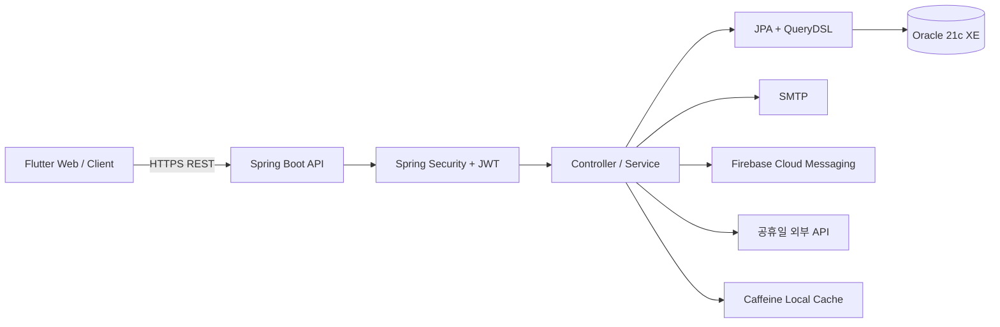
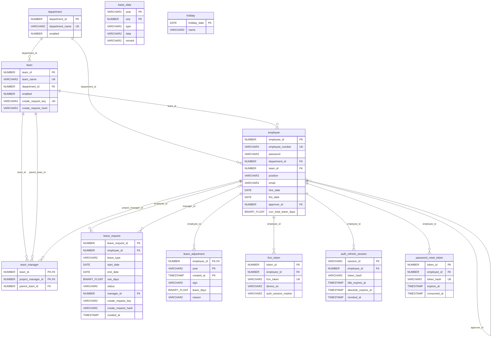

# annual-leave-backend

`annual-leave-backend`는 사내 연차(휴가) 관리 앱의 백엔드 API 서버입니다.
직원의 연차 신청·조회·취소, 관리자의 승인·반려, 조직/사원 관리, 대시보드 집계, 공휴일 동기화, 인증/SSO 및 푸시 알림을 담당합니다.


## 시스템 아키텍처


```mermaid
flowchart LR
    C[Flutter Web / Client] -->|HTTPS REST| A[Spring Boot API]
    A --> S[Spring Security + JWT]
    S --> B[Controller / Service]
    B --> J[JPA + QueryDSL]
    J --> O[(Oracle 21c XE)]
    B --> M[SMTP]
    B --> F[Firebase Cloud Messaging]
    B --> H[공휴일 외부 API]
    B --> K[Caffeine Local Cache]
```

- 단일 인스턴스 서버를 전제로 하며 애플리케이션 캐시는 Caffeine 로컬 캐시를 사용합니다.
- Access Token은 JWT, Refresh Token은 HttpOnly Cookie 기반 Rotation 세션으로 관리합니다.
- Oracle 스키마는 `sql/schema.sql`이 현재 정본이며 애플리케이션 시작 시 Hibernate `ddl-auto=validate`로 Entity와 검증합니다.


## 사용 기술

| 구분 | 기술 | 비고 |
|---|---|---|
| 언어/런타임 | Java 21 | `sourceCompatibility=21`, `-parameters` 컴파일 |
| 프레임워크 | Spring Boot 4.1.0 | Spring Web MVC 기반 |
| 빌드 도구 | Gradle (Groovy DSL) | `gradlew`, `bootJar` → `annual-leave-backend.jar` |
| 데이터베이스 | Oracle 21c XE | `ojdbc11`, canonical schema: `sql/schema.sql` |
| 영속성 | Spring Data JPA + QueryDSL | Hibernate `ddl-auto=validate` |
| SQL 로깅 | p6spy | 파라미터 로깅/마스킹 정책 적용 |
| 보안 | Spring Security + JWT | Stateless Access JWT + Refresh Token Rotation |
| 캐시 | Caffeine | 단일 인스턴스 로컬 인메모리 캐시 |
| 메일 | Spring Mail (SMTP) | Gmail STARTTLS |
| 푸시 | Firebase Admin SDK 9.10.0 | FCM 중심, 불필요한 Firestore/Storage/gRPC/Netty 제외 |
| HTTP 클라이언트 | Spring WebFlux `WebClient` | JDK `HttpClient` 커넥터, Reactor Netty 제외 |
| 검증 | Bean Validation | `jakarta.validation` |
| API 문서 | springdoc-openapi | 운영 기본 비활성화 |
| 보조 | Lombok, Jackson 3.x | Spring Boot 4 계열 |


## 기능

- **인증/SSO**: 로그인, 사용 등록, Access Token 재발급, Refresh Token Rotation, 로그아웃, 세션 식별자, 아이디/이메일 찾기, 비밀번호 재설정
- **조직/사원 관리**: 부서·팀 관리, 팀 관리자(PM)와 상위 팀 관계 관리, 사원 정보/관리팀 설정
- **휴가 신청**: 휴가 신청, 상세 조회, 내 신청/전체 신청 조회, 신청 취소, 멱등성 키 처리
- **휴가 승인**: 승인 대기 조회, 승인/반려, 처리 내역 조회, 현재 조직 권한 기반 결재권 검증
- **연차/대시보드**: 현재 연차기간, 잔여 연차 및 대시보드 집계
- **공휴일**: 금년/차년도 공휴일 동기화 및 휴가 일수 계산 반영
- **알림**: FCM 토큰 동기화와 휴가 처리 알림


## 정책 / 핵심 비즈니스 로직

- 연차 기준연도는 현재 회계연도(1월 1일~12월 31일)이며 기간 판단의 정본은 백엔드입니다.
- 휴가 목록 API는 `PageResponseDto<T>`를 사용합니다. `items`는 현재 페이지 데이터, `totalCount`는 동일 검색조건의 전체 건수, `hasMore`는 서버가 판정한 추가 조회 가능 여부입니다.
- 목록 기본 크기는 50건입니다. 최초 요청은 `page/size`, 이후 무한스크롤은 `cursorRequestedAt|cursorCreatedAt + cursorRequestId` 조합을 사용할 수 있습니다.
- `/api/leave-requests/all`은 일반 사용자에게도 열려 있으며, 내 신청만 보고 싶을 때는 `/my` 또는 클라이언트 필터를 사용합니다.
- 승인 대기(PENDING)는 직접 관리팀과 하위 팀장의 신청을 대상으로 하고, 승인/반려 처리 내역은 현재 접근 가능한 전체 관리팀 범위를 사용합니다.
- 관리자 여부와 결재권은 로그인 시점 JWT role snapshot이 아니라 **현재 조직 상태**를 기준으로 다시 검증합니다.
- 휴가 승인/반려는 PENDING 상태에서만 상태 전이가 가능하도록 조건부 갱신하여 중복 처리 경쟁을 방지합니다.
- 휴가 신청 생성은 선택적 `Idempotency-Key`를 지원하며 동일 key에 다른 payload를 재사용하면 거부합니다.
- 휴가 취소는 PENDING 또는 APPROVED만 가능하며, 이미 시작일에 도달한 APPROVED 휴가는 취소할 수 없습니다.
- `TEAM_MANAGER`는 팀 관리자와 상위 팀 관계를 관리합니다. PM 퇴사 처리로 결재 공백이 생기는 경우 DB guard trigger가 차단합니다.
- Refresh Token 원문은 DB에 저장하지 않고 hash와 rotation 상태만 `AUTH_REFRESH_SESSION`에 저장합니다.


## ERD


```mermaid
erDiagram
    department ||--o{ team : "department_id"
    department ||--o{ employee : "department_id"
    team ||--o{ employee : "team_id"
    team ||--o{ team_manager : "team_id"
    team ||--o{ team_manager : "parent_team_id"
    employee ||--o{ team_manager : "project_manager_id"
    employee ||--o{ employee : "approver_id"
    employee ||--o{ leave_request : "employee_id"
    employee |o--o{ leave_request : "manager_id"
    employee ||--o{ leave_adjustment : "employee_id"
    employee ||--o{ fcm_token : "employee_id"
    employee ||--o{ auth_refresh_session : "employee_id"
    employee ||--o{ password_reset_token : "employee_id"

    department { NUMBER department_id PK VARCHAR2 department_name UK NUMBER enabled }
    team { NUMBER team_id PK VARCHAR2 team_name UK NUMBER department_id FK NUMBER enabled VARCHAR2 create_request_key UK VARCHAR2 create_request_hash }
    employee { NUMBER employee_id PK VARCHAR2 employee_number UK VARCHAR2 password NUMBER department_id FK NUMBER team_id FK VARCHAR2 position VARCHAR2 email DATE hire_date DATE fire_date NUMBER approver_id FK BINARY_FLOAT curr_total_leave_days }
    team_manager { NUMBER team_id PK,FK NUMBER project_manager_id PK,FK NUMBER parent_team_id FK }
    leave_request { NUMBER leave_request_id PK NUMBER employee_id FK VARCHAR2 leave_type DATE start_date DATE end_date BINARY_FLOAT use_days VARCHAR2 status NUMBER manager_id FK VARCHAR2 create_request_key VARCHAR2 create_request_hash TIMESTAMP created_at }
    leave_adjustment { NUMBER employee_id PK,FK VARCHAR2 year PK TIMESTAMP created_at PK VARCHAR2 sign BINARY_FLOAT leave_days VARCHAR2 reason }
    basis_data { VARCHAR2 year PK NUMBER seq PK VARCHAR2 type VARCHAR2 data VARCHAR2 remark }
    holiday { DATE holiday_date PK VARCHAR2 name }
    fcm_token { NUMBER token_id PK NUMBER employee_id FK VARCHAR2 fcm_token UK VARCHAR2 device_os VARCHAR2 auth_session_marker }
    auth_refresh_session { VARCHAR2 session_id PK NUMBER employee_id FK VARCHAR2 token_hash TIMESTAMP idle_expires_at TIMESTAMP absolute_expires_at TIMESTAMP revoked_at }
    password_reset_token { NUMBER token_id PK NUMBER employee_id FK VARCHAR2 token_hash UK TIMESTAMP expires_at TIMESTAMP consumed_at }
```


## API 엔드포인트

권한 표기: 🟢 공개 / 🔵 인증 사용자 / 🔴 현재 관리자·인사권 필요

### AuthController — `/api/auth`

| 권한 | 메서드 | 경로 | 요청 | 응답 | 상태 |
|---|---|---|---|---|---|
| 🟢 | POST | `/signup` | `SignUpDto.SignUpRequest` | `SignUpDto.SignUpResponse` | 200 |
| 🟢 | POST | `/signin` | `SignInDto.SignInRequest` | `SignInDto.SignInResponse` + Refresh Cookie | 200 |
| 🟢 | POST | `/refresh` | Refresh Cookie, `X-SSO-Refresh: 1` | `SignInDto.SignInResponse` + rotated cookie | 200 |
| 🟢 | POST | `/session-marker` | Refresh Cookie, `X-SSO-Refresh: 1` | `{ sessionMarker }` | 200 |
| 🟢 | POST | `/find-email-by-id` | `FindDataDto.FindEmailByIdRequest` | `FindDataDto.EmailResponse` | 200 |
| 🟢 | POST | `/find-email-by-employee-number` | `FindDataDto.FindEmailByEmployeeNumberRequest` | `FindDataDto.EmailResponse` | 200 |
| 🟢 | POST | `/forgot-password` | `FindDataDto.FindPasswordRequest` | `Void` | 200 |
| 🟢 | POST | `/reset-password` | `FindDataDto.ResetPasswordRequest` | `Void` | 200 |
| 🟢 | POST | `/find-id` | `FindDataDto.FindIdRequest` | `Void` | 200 |
| 🟢/🔵 | POST | `/logout` | Refresh Cookie, `LogoutDto.LogoutRequest`(선택) | `Void` | 204 |

> `/refresh`, `/session-marker`, `/logout`은 Access JWT와 별개로 공통 HttpOnly Refresh Cookie 생명주기를 처리합니다. Refresh 계열 요청은 `X-SSO-Refresh: 1` 헤더를 요구합니다.

### AdminAuthController — `/api/admin/auth`

| 권한 | 메서드 | 경로 | 요청 | 응답 |
|---|---|---|---|---|
| 🔴 | POST | `/sync-fcm-token` | `FcmTokenDto.FcmTokenRequest` | `Void` |
| 🔴 | GET | `/common` | 없음 | `RegisterCommonDto.RegisterCommonResponse` |
| 🔴 | POST | `/register` | `RegisterDto.RegisterRequest` | `RegisterDto.RegisterResponse` |

### AdminEmployeeController — `/api/admin/employees`

| 권한 | 메서드 | 경로 | 요청 | 응답 |
|---|---|---|---|---|
| 🔴 | GET | `/all` | `searchParam`, `team`, `registered`, `page`, `size` | `List<EmployeeDto.EmployeeResponse>` |
| 🔴 | PUT | `/{employeeNumber}/managed-teams` | `EmployeeDto.ManagedTeamsUpdateRequest` | `Void` |
| 🔴 | PUT | `/{employeeNumber}` | `EmployeeDto.EmployeeAdminUpdateRequest` | `Void` |

### AdminDepartmentController — `/api/admin/departments`

| 권한 | 메서드 | 경로 | 요청 | 응답 |
|---|---|---|---|---|
| 🔴 | GET | (루트) | 없음 | `List<DepartmentDto.DepartmentResponse>` |
| 🔴 | POST | (루트) | `DepartmentDto.CreateRequest` | `DepartmentDto.CreateResponse` |
| 🔴 | PUT | `/{departmentId}` | `DepartmentDto.UpdateRequest` | `Void` |
| 🔴 | DELETE | `/{departmentId}` | 없음 | `Void` |

> 부서/팀 관리 API는 일반 관리자보다 강한 현재 인사권(`@RequirePersonnelAuthority`)을 요구합니다.

### AdminTeamController — `/api/admin/teams`

| 권한 | 메서드 | 경로 | 요청 | 응답 |
|---|---|---|---|---|
| 🔴 | GET | (루트) | 없음 | `List<TeamDto.TeamResponse>` |
| 🔴 | POST | (루트) | `TeamDto.CreateRequest`, `Idempotency-Key`(선택) | `TeamDto.CreateResponse` |
| 🔴 | PUT | `/{teamId}` | `TeamDto.UpdateRequest` | `Void` |
| 🔴 | DELETE | `/{teamId}` | 없음 | `Void` |

### EmployeeController — `/api/employees`

| 권한 | 메서드 | 경로 | 요청 | 응답 | 상태 |
|---|---|---|---|---|---|
| 🔵 | GET | `/me` | 없음 | `EmployeeDto.EmployeeResponse` | 200 |
| 🔵 | PATCH | `/me/email` | `EmployeeDto.ModifyEmailRequest` | `Void` | 200 |
| 🔵 | PATCH | `/me/password` | `EmployeeDto.PasswordChangeRequest` | `Void` | 204 |

### LeaveRequestController — `/api/leave-requests`

| 권한 | 메서드 | 경로 | 요청 | 응답 | 상태 |
|---|---|---|---|---|---|
| 🔵 | GET | `/current-year-special-days` | 없음 | `List<SpecialDayDto.SpecialDayResponse>` | 200 |
| 🔵 | GET | `/next-year-special-days` | 없음 | `List<SpecialDayDto.SpecialDayResponse>` | 200 |
| 🔵 | POST | (루트) | `LeaveRequestDto.LeaveRequestCreateRequest`, `Idempotency-Key`(선택) | `LeaveRequestDto.LeaveRequestCreateResponse` | 201 |
| 🔵 | GET | `/all` | 검색조건 + `page/size` + cursor(선택) | `PageResponseDto<LeaveRequestListResponse>` | 200 |
| 🔵 | GET | `/{requestId}` | 없음 | `LeaveRequestDetailDto.LeaveRequestDetailResponse` | 200 |
| 🔵 | GET | `/my/period` | 없음 | `DashboardDto.LeavePeriodResponse` | 200 |
| 🔵 | GET | `/my` | 검색조건 + `page/size` + cursor(선택) | `PageResponseDto<LeaveRequestListResponse>` | 200 |
| 🔵 | DELETE | `/{requestId}` | 없음 | `Void` | 204 |

> `/my/period`의 `startDate/endDate`가 현재 적용 중인 연차기간의 정본입니다. 클라이언트는 기간 정책을 별도로 추정하지 않습니다.

### LeaveApprovalController — `/api/admin/leave-requests`

| 권한 | 메서드 | 경로 | 요청 | 응답 |
|---|---|---|---|---|
| 🔴 | GET | `/pending` | `page/size`, cursor(선택) | `PageResponseDto<PendingLeaveRequestResponse>` |
| 🔴 | GET | `/approved` | `team`, `employeeParam`, `page/size`, cursor(선택) | `PageResponseDto<LeaveRequestListResponse>` |
| 🔴 | GET | `/rejected` | `team`, `employeeParam`, `page/size`, cursor(선택) | `PageResponseDto<LeaveRequestListResponse>` |
| 🔴 | POST | `/{requestId}/approve` | 없음 | `LeaveApprovalDto.LeaveApprovalResponse` |
| 🔴 | POST | `/{requestId}/reject` | `LeaveRejectDto.LeaveRejectRequest` | `LeaveRejectDto.LeaveRejectResponse` |

### DashboardController — `/api/dashboard`

| 권한 | 메서드 | 경로 | 요청 | 응답 |
|---|---|---|---|---|
| 🔵 | GET | (루트) | 없음 | `DashboardDto` |

### HealthController — `/api/health`

| 권한 | 메서드 | 경로 | 응답 |
|---|---|---|---|
| 🟢 | GET | (루트) | 단순 서비스 상태 정보 |


## 인증 / 권한 기준

Access JWT는 사용자 식별과 로그인 시점 role snapshot을 포함하지만, 관리자 권한의 최종 근거로 사용하지 않습니다.

- Spring Security는 `/api/auth/**`, `/api/health`를 공개하고 그 외 요청은 인증을 요구합니다.
- `/api/admin/**`는 `AdminAuthorizationInterceptor`가 현재 권한을 중앙 검증합니다.
- 일반 관리자 API는 현재 TeamManager 여부를 기준으로 검증합니다.
- 부서/팀 관리처럼 별도 인사권이 필요한 API는 `@RequirePersonnelAuthority`를 사용합니다.
- 휴가 승인/반려는 관리자 여부와 별개로 해당 신청에 대한 현재 결재권도 다시 검증합니다.
- 따라서 로그인 이후 PM 승격/해제가 발생해도 JWT role snapshot보다 현재 조직 상태가 실제 권한의 기준입니다.
- Refresh Cookie는 `HttpOnly`, `Secure`, `SameSite=Strict`가 기본값이며 idle/absolute TTL과 짧은 replay grace를 별도로 관리합니다.


## 테스트 / CI

- `develop_v1.0`, `develop_v2.0` push와 수동 실행에서 Backend CI가 동작합니다.
- CI는 Oracle 21c XE 컨테이너를 기동하고 `sql/schema.sql`과 `sql/data.sql`을 실제 적용한 뒤 `./gradlew test bootJar`를 실행합니다.
- `RUN_ORACLE_INTEGRATION_TESTS=true`일 때 Oracle 통합 테스트도 함께 실행합니다.
- 단위/회귀 테스트는 Oracle 연결 없이 실행할 수 있으며 Oracle 통합 테스트만 조건부로 분리됩니다.


## DB / 배포

현재 `sql/`에는 재사용 가치가 있는 정본만 유지합니다.

- `sql/schema.sql`: 현재 Oracle 스키마 정본
- `sql/data.sql`: 개발/CI seed
- `sql/dba_prepare_common_auth_tablespace.sql`: Fresh install 전 `COMMON_DATA / COMMON_INDEX` 준비용 DBA 1회 스크립트

배포는 다음 흐름을 사용합니다.

- `release` push → Backend CD 자동 실행
- `workflow_dispatch` → 선택한 ref를 수동 배포
- Gradle `bootJar -x test` → JAR 업로드 → 기존 JAR 백업 → systemd 재시작
- 현재 CD의 기동 판정은 `systemctl is-active annual-leave.service` 기준이며, 실패 시 이전 JAR로 rollback합니다.


## 빌드 / 실행 방법

### 빌드

```bash
./gradlew test bootJar
```

생성 파일:

```text
build/libs/annual-leave-backend.jar
```

### 필수 환경변수

최소한 다음 값이 필요합니다.

```text
DB_URL
DB_USERNAME
DB_PASSWORD
JWT_SECRET
SERVICE_KEY
MAIL_HOST
MAIL_PORT
MAIL_USERNAME
MAIL_PASSWORD
```

운영에서 Refresh Token Rotation을 사용할 때는 `AUTH_REFRESH_SIGNING_SECRET`을 별도로 지정하는 것을 권장합니다. 지정하지 않으면 `JWT_SECRET`을 사용합니다.

주요 선택 환경변수:

```text
JWT_TIMEOUT
AUTH_REFRESH_IDLE_TTL
AUTH_REFRESH_ABSOLUTE_TTL
AUTH_REFRESH_REPLAY_GRACE
AUTH_REFRESH_SESSION_RETENTION
AUTH_REFRESH_TOKEN_BYTES
AUTH_REFRESH_COOKIE_NAME
AUTH_REFRESH_COOKIE_PATH
AUTH_REFRESH_COOKIE_SECURE
AUTH_REFRESH_COOKIE_SAME_SITE
AUTH_REFRESH_CLEANUP_CRON
CORS_ALLOWED_ORIGINS
FIREBASE_CREDENTIAL_PATH
SPRINGDOC_ENABLED
```

### 실행

```bash
./gradlew bootRun
```

또는:

```bash
java -jar build/libs/annual-leave-backend.jar
```

`application.yml`은 프로젝트 루트의 선택적 `.env` 파일도 읽습니다.
