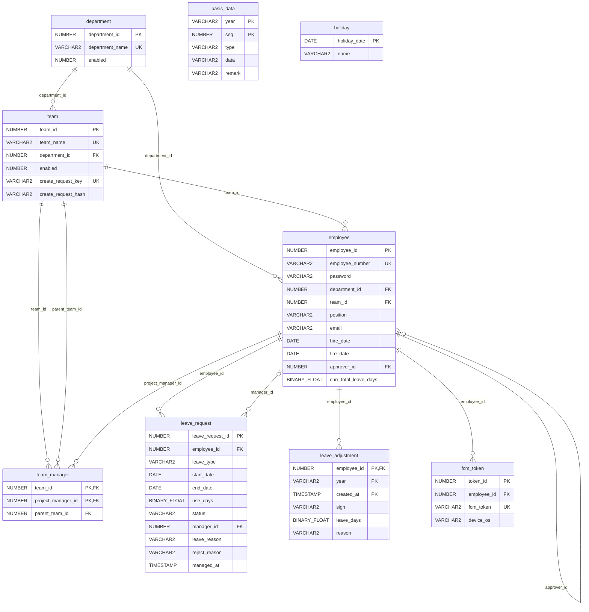

# annual-leave-backend

`annual-leave-backend`는 사내 연차(휴가) 관리 앱의 백엔드 API 서버입니다.
직원의 연차 신청, 조회, 관리자의 승인, 반려 그리고 대시보드 집계, 공휴일 동기화, 푸시 알림을 담당합니다.

## 시스템 아키텍처

## 사용 기술

| 구분 | 기술 | 비고                                                          |
|---|---|-------------------------------------------------------------|
| 언어/런타임 | Java 21 | `sourceCompatibility=21`, `-parameters` 컴파일 (툴체인 블록 비활성)    |
| 프레임워크 | Spring Boot 4.1.0 | Spring Web MVC 기반                                           |
| 빌드 도구 | Gradle (Groovy DSL) | `gradlew` 래퍼, `bootJar` → `annual-leave-backend.jar`        |
| 데이터베이스 | Oracle 21c XE | `com.oracle.database.jdbc:ojdbc11`, canonical schema: `sql/schema.sql` |
| 영속성 | Spring Data JPA (Hibernate) | `ddl-auto` 미설정 (스키마 자동 생성 안 함)                              |
| SQL 로깅 | p6spy | `p6spy-spring-boot-starter:2.0.1`, `spy.properties`         |
| 보안 | Spring Security + JWT | `jjwt 0.13.0`, 무상태 세션                                       |
| 캐시 | Caffeine | 로컬 인메모리 캐시                                                  |
| 메일 | Spring Mail (SMTP) | Gmail STARTTLS                                              |
| 푸시 | Firebase Admin SDK 9.10.0 | Firestore/Storage/gRPC/Netty 등 미사용 모듈 제외                    |
| HTTP 클라이언트 | Spring WebFlux `WebClient` | JDK `HttpClient` 커넥터 사용, Netty(reactor-netty) 제외            |
| 검증 | Bean Validation (jakarta) | `spring-boot-starter-validation`                            |
| 보조 | Lombok, Jackson 3.x | Jackson은 `tools.jackson.*` 패키지(Spring Boot 4 계열)            |

## 기능

## 정책 / 핵심 비즈니스 로직

## ERD

```mermaid
erDiagram
    department ||--o{ team : "department_id"
    department ||--o{ employee : "department_id"
    team ||--o{ employee : "team_id"
    team ||--o{ team_manager : "team_id"
    team ||--o{ team_manager : "parent_team_id"
    employee ||--o{ team_manager : "project_manager_id"
    employee ||--o{ employee : "approver_id"
    employee ||--o{ leave_request : "employee_id"
    employee |o--o{ leave_request : "manager_id"
    employee ||--o{ leave_adjustment : "employee_id"
    employee ||--o{ fcm_token : "employee_id"

    department { NUMBER department_id PK VARCHAR2 department_name UK NUMBER enabled }
    team { NUMBER team_id PK VARCHAR2 team_name UK NUMBER department_id FK NUMBER enabled VARCHAR2 create_request_key UK VARCHAR2 create_request_hash }
    employee { NUMBER employee_id PK VARCHAR2 employee_number UK VARCHAR2 password NUMBER department_id FK NUMBER team_id FK VARCHAR2 position VARCHAR2 email DATE hire_date DATE fire_date NUMBER approver_id FK BINARY_FLOAT curr_total_leave_days }
    team_manager { NUMBER team_id PK,FK NUMBER project_manager_id PK,FK NUMBER parent_team_id FK }
    leave_request { NUMBER leave_request_id PK NUMBER employee_id FK VARCHAR2 leave_type DATE start_date DATE end_date BINARY_FLOAT use_days VARCHAR2 status NUMBER manager_id FK VARCHAR2 leave_reason VARCHAR2 reject_reason TIMESTAMP managed_at }
    leave_adjustment { NUMBER employee_id PK,FK VARCHAR2 year PK TIMESTAMP created_at PK VARCHAR2 sign BINARY_FLOAT leave_days VARCHAR2 reason }
    basis_data { VARCHAR2 year PK NUMBER seq PK VARCHAR2 type VARCHAR2 data VARCHAR2 remark }
    holiday { DATE holiday_date PK VARCHAR2 name }
    fcm_token { NUMBER token_id PK NUMBER employee_id FK VARCHAR2 fcm_token UK VARCHAR2 device_os }
```

> Fresh install은 `sql/schema.sql`, 기존 develop_v1.0 DB 이관은 `sql/migration_v2_0_oracle.sql`을 기준으로 한다.

## API 엔드포인트

권한 표기: 🟢 공개 / 🔵 일반 사용자 / 🔴 관리자

### AuthController — `/api/auth`
| 권한 | 메서드 | 경로 | 요청 | 응답 | 상태 |
|---|---|---|---|---|---|
| 🟢 | POST | `/signup` | `SignUpDto.SignUpRequest` | `SignUpDto.SignUpResponse` | 200 |
| 🟢 | POST | `/signin` | `SignInDto.SignInRequest` | `SignInDto.SignInResponse` | 200 |
| 🟢 | POST | `/find-email-by-id` | `FindDataDto.FindEmailByIdRequest` | `FindDataDto.EmailResponse` | 200 |
| 🟢 | POST | `/find-email-by-employee-number` | `FindDataDto.FindEmailByEmployeeNumberRequest` | `FindDataDto.EmailResponse` | 200 |
| 🟢 | POST | `/forgot-password` | `FindDataDto.FindPasswordRequest` | `Void` | 200 |
| 🟢 | POST | `/find-id` | `FindDataDto.FindIdRequest` | `Void` | 200 |
| 🔵 | POST | `/logout` | `@AuthenticationPrincipal`, `LogoutDto.LogoutRequest`(선택) | `Void` | 200 |

### AdminAuthController — `/api/admin/auth`
| 권한 | 메서드 | 경로 | 요청 | 응답 |
|---|---|---|---|---|
| 🔴 | POST | `/sync-fcm-token` | `FcmTokenDto.FcmTokenRequest` | `Void` |
| 🔴 | GET | `/common` | `@AuthenticationPrincipal` | `RegisterCommonDto.RegisterCommonResponse` |
| 🔴 | POST | `/register` | `@AuthenticationPrincipal`, `RegisterDto.RegisterRequest` | `RegisterDto.RegisterResponse` |

### AdminEmployeeController — `/api/admin/employees`
| 권한 | 메서드 | 경로 | 요청 | 응답 |
|---|---|---|---|---|
| 🔴 | GET | `/all` | `@RequestParam searchParam`(선택) | `List<EmployeeDto.EmployeeResponse>` |
| 🔴 | PUT | `/{employeeNumber}/managed-teams` | `EmployeeDto.ManagedTeamsUpdateRequest` | `Void` |
| 🔴 | PUT | `/{employeeNumber}` | `EmployeeDto.EmployeeAdminUpdateRequest` | `Void` |

### AdminDepartmentController — `/api/admin/departments`
| 권한 | 메서드 | 경로 | 요청 | 응답 |
|---|---|---|---|---|
| 🔴 | GET | (루트) | 없음 | `List<DepartmentDto.DepartmentResponse>` |
| 🔴 | POST | (루트) | `DepartmentDto.CreateRequest` | `DepartmentDto.CreateResponse` |
| 🔴 | PUT | `/{departmentId}` | `DepartmentDto.UpdateRequest` | `Void` |
| 🔴 | DELETE | `/{departmentId}` | 없음 | `Void` |

### AdminTeamController — `/api/admin/teams`
| 권한 | 메서드 | 경로 | 요청 | 응답 |
|---|---|---|---|---|
| 🔴 | GET | (루트) | 없음 | `List<TeamDto.TeamResponse>` |
| 🔴 | POST | (루트) | `TeamDto.CreateRequest`, `Idempotency-Key`(선택) | `TeamDto.CreateResponse` |
| 🔴 | PUT | `/{teamId}` | `TeamDto.UpdateRequest` | `Void` |
| 🔴 | DELETE | `/{teamId}` | 없음 | `Void` |

### EmployeeController — `/api/employees`
| 권한 | 메서드 | 경로 | 요청 | 응답 | 상태 |
|---|---|---|---|---|---|
| 🔵 | GET | `/me` | `@AuthenticationPrincipal` | `EmployeeDto.EmployeeResponse` | 200 |
| 🔵 | PATCH | `/me/email` | `EmployeeDto.ModifyEmailRequest` | `Void` | 200 |
| 🔵 | PATCH | `/me/password` | `EmployeeDto.PasswordChangeRequest` | `Void` | 204 |

### LeaveRequestController — `/api/leave-requests`
| 권한 | 메서드 | 경로 | 요청 | 응답 | 상태 |
|---|---|---|---|---|---|
| 🔵 | GET | `/current-year-special-days` | 없음 | `List<SpecialDayDto.SpecialDayResponse>` | 200 |
| 🔵 | GET | `/next-year-special-days` | 없음 | `List<SpecialDayDto.SpecialDayResponse>` | 200 |
| 🔵 | POST | (루트) | `LeaveRequestDto.LeaveRequestCreateRequest` | `LeaveRequestDto.LeaveRequestCreateResponse` | 201 |
| 🔵 | GET | `/all` | `LeaveRequestListDto.LeaveRequestListRequest`(쿼리) | `List<LeaveRequestListDto.LeaveRequestListResponse>` | 200 |
| 🔵 | GET | `/{requestId}` | 없음 | `LeaveRequestDetailDto.LeaveRequestDetailResponse` | 200 |
| 🔵 | GET | `/my/period` | 없음 | `DashboardDto.LeavePeriodResponse` | 200 |
| 🔵 | GET | `/my` | `LeaveRequestListDto.LeaveRequestListRequest`(쿼리) | `List<LeaveRequestListDto.LeaveRequestListResponse>` | 200 |
| 🔵 | DELETE | `/{requestId}` | 없음 | `Void` | 204 |

> `/my/period`의 `startDate/endDate`가 현재 적용 중인 연차기간의 정본이다. 현재 정책은 회계연도(1/1~12/31)지만, 클라이언트는 정책 종류를 하드코딩하지 않고 이 범위를 사용한다.

### LeaveApprovalController — `/api/admin/leave-requests`
| 권한 | 메서드 | 경로 | 요청 | 응답 |
|---|---|---|---|---|
| 🔴 | GET | `/pending` | 없음 | `List<PendingLeaveRequestDto.PendingLeaveRequestResponse>` |
| 🔴 | GET | `/approved` | `team`, `employeeParam`(선택) | `List<LeaveRequestListDto.LeaveRequestListResponse>` |
| 🔴 | GET | `/rejected` | `team`, `employeeParam`(선택) | `List<LeaveRequestListDto.LeaveRequestListResponse>` |
| 🔴 | POST | `/{requestId}/approve` | 없음 | `LeaveApprovalDto.LeaveApprovalResponse` |
| 🔴 | POST | `/{requestId}/reject` | `LeaveRejectDto.LeaveRejectRequest` | `LeaveRejectDto.LeaveRejectResponse` |

### DashboardController — `/api/dashboard`
| 권한 | 메서드 | 경로 | 요청 | 응답 |
|---|---|---|---|---|
| 🔵 | GET | (루트) | `@AuthenticationPrincipal` | `DashboardDto` |

## 빌드 / 실행 방법